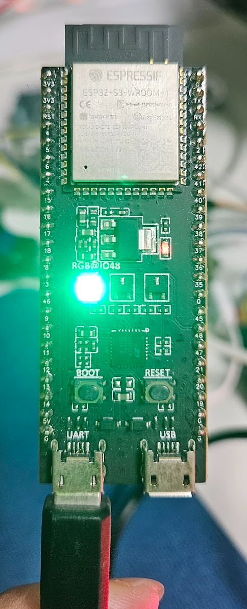
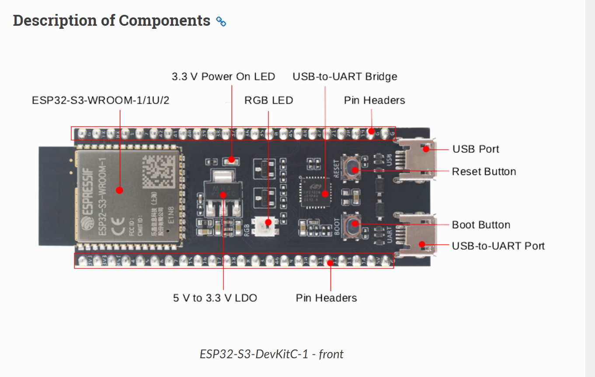
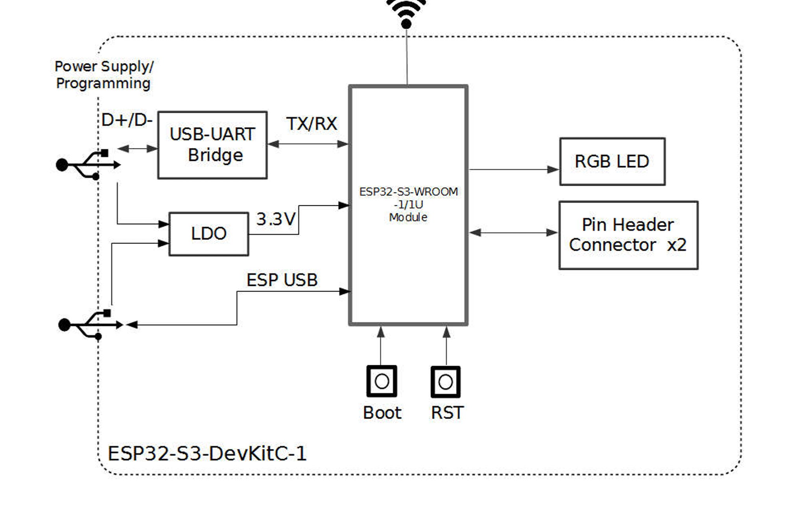
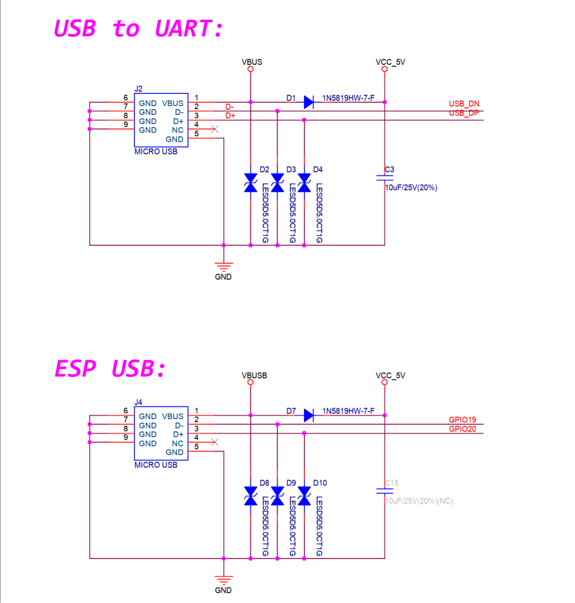

# ESP32-S3

<br/>

* ESP32-S3 DevkitC1     
반드시 2개의 USB를 사용해서 진행  아래는 오직 TEST 용    


<br/>


## Firmware 

<br/>


* Python Setup      
```
pip install -r .\requirements.txt
```


* Python Package Backup 

```
pip freeze > requirements.txt
```

<br/>

## Hardware

<br/>

* ESP32-S3 DevkitC-1 Manual          
   * [ESP32-S3 DevkitC-1 Manual](https://docs.espressif.com/projects/esp-idf/en/v5.3/esp32s3/hw-reference/esp32s3/user-guide-devkitc-1.html)   
   

<br/>

* ESP32-S3 DevkitC-1 Schemetic      
   * [ESP32-S3 DevkitC-1](https://dl.espressif.com/dl/schematics/SCH_ESP32-S3-DevKitC-1_V1.1_20221130.pdf)
   * ESP32-S3 DevkitC1 의 USB Port 2개 구성 
      * USB To UART(USB To Serial, CP2102N ) ---> 세부내용은 회로도 확인            
      * ESP USB (아래 각 포트확인)         
      
      

<br/>


## USB Ports 

<br/>

* USB Ports     
   1. COM A (CP2102N): 플래시 / 모니터(로그)
      * 상위 USB To Serial 로 ESP32-S3 Monitor와 명령어 전달        
   2. COM B (TinyUSB CDC)
      * Wi-Fi 스니퍼 캡처 스트림 (Python 파서로 pcap 저장 → Wireshark)        

<br/>

* USB-CDC ACM 을 이용하여 사용예정 
   * 2번째는 TinyUSB 기반의 CDC를 이용하여 사용    
   * [TinyUSB 이해](https://docs.espressif.com/projects/esp-iot-solution/en/latest/usb/usb_overview/tinyusb_guide.html)          

<br/>

## Wifi Sniffer 

<br/>

* WIFI Sniffer TEST 방법 및 Capture방법           
   * [Wifi Sniffter only Display](wifi_sniffer0.md) 
   * [Wifi Sniffer Capture](wifi_sniffer1.md)

<br/>


## Wireshark 

<br/>

* Wireshark 분석 방법              
   1. output의 *.pcap  Wireshark로 분석 
   2. 현재 STA/AP 설정을 하지 않았으므로, 기본적인 Beacon 과 PR만 확인가능   
   3. **WLAN(Ethernet2)이 아닌 WIFI Packet으로 분석가능**    
      * tcpdump로도 할 생각이였으나, WIFI Packet 분석가능하다    

<br/>

* Wireshark 분석 예제  
   * [Wireshark0](wireshark_0.md) 

<br/>
